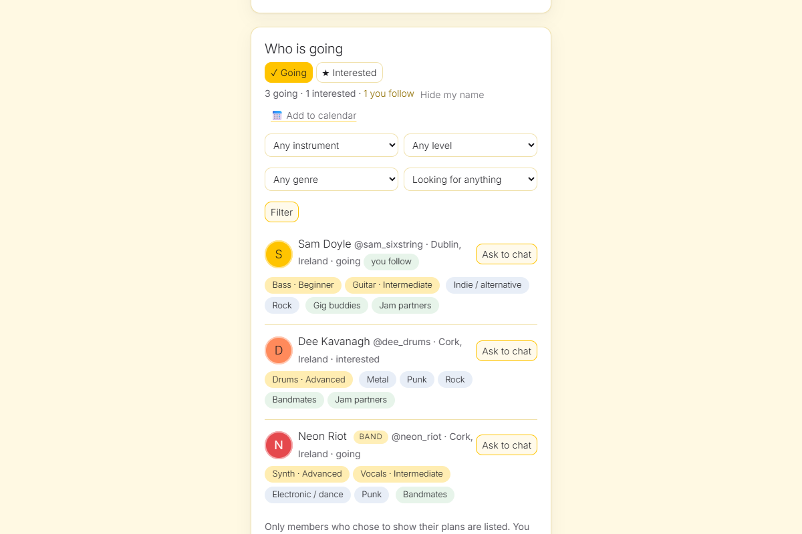
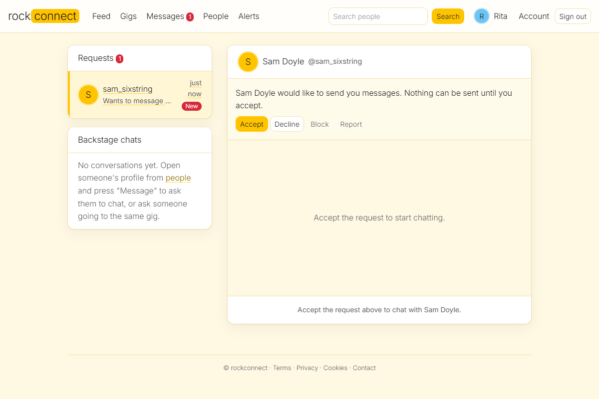

<!--
  File: SOCIAL.md
  Author: mrbacco04@gmail.com
  Date: 2026-10-06
-->
# The social side: going to gigs, finding people

## What members can do
* **Say they are going** (or interested) on any gig: gigs announced by members, and gigs imported from Ticketmaster, Skiddle and
  Songkick. Buttons are on every gig card, on the gig's own page and under every "Gigs near you" result.
* **See who else is going**, with what they play, the genres they like and what they are looking for, filter that list
  (for example "bass players going to this gig") and press **Ask to chat**.
* **Describe themselves** in *Edit profile*: instruments (22 to choose from), genres (16), and what they are looking for (gig buddies,
  jam partners, bandmates, sharing a lift, new friends). Chosen from fixed lists, so filters work.
* **Find people** on the People page by instrument, genre and goal (plus the existing name, place and fan/band/venue filters).
* **See their plans** on *My gigs*, and on other members' profiles ("Going to").

## Privacy (decided with the owner)
* Plans are visible to signed-in members by default. A member can make **one RSVP private** (counted, not named) or **hide all
  plans** in Edit profile (not named, not counted for others).
* Suspended members, blocked members (both ways) never appear in lists, counts or search.
* **Message requests:** nobody can write to a stranger. *Message* / *Ask to chat* only sends a request, with no text. The other person
  sees it under *Requests* and can accept, decline, block or report. Until they accept, **neither side can send a message** and nothing
  from the asker is shown to them. A declined request is silent for the asker (it just never gets an answer). Requests from blocked or
  suspended members are not shown. New requests are limited to 15 per day per member. Chats that were open before this rule stay open.
* The small copy of an imported gig kept with an RSVP is deleted a day after the gig (providers only allow short-term storage);
  member-announced gigs keep theirs for 30 days.
* Everything is in the GDPR export and is erased with the account.

## Skill levels
Each instrument can carry a level: beginner, intermediate, advanced or professional (optional). The People page and the "who is
going" list filter by *at least* a level ("bass, advanced or better"), and the level shows next to the instrument.

## Following and notifications
* **Follow** any member from their profile or the People page. It needs no permission. Only you see the lists of who you
  follow and who follows you; other members see just the counts on your profile. The feed has two tabs: *Everyone* and *People I follow*.
* **The bell** (alerts) in the menu shows: a new follower, and "<member> is going to <gig>" when someone you follow says
  they are going. Not for "interested", not for a private RSVP and not when they hide their plans. Gig notices can be switched
  off in *Edit profile*. At most 200 followers are notified per RSVP, a changed mind does not notify twice, and read notices
  are deleted after 30 days (any after 90).
* People you follow come first in the "who is going" list, and the counts show "n you follow" next to the totals.
* Blocking someone removes the follow both ways.

## Talk about this gig
Under every gig there is a discussion ("anyone driving from Dublin?", "doors are at 7"). It is one thread per concert, even if
the gig is listed by two services. Posting needs a signed-in member (and a confirmed email where that is required): up to
1000 characters, 30 comments an hour. Authors delete their own; admins delete any (logged); anyone can **report** a comment
and admins remove it from the report queue. It stays open until a week after the gig and is deleted with the gig data.
Suspended and blocked authors are not shown.

## Add to calendar
*Add to calendar* on a gig page downloads a standard `.ics` file (Google, Apple and Outlook calendars read it). *My gigs* has
*Add all to my calendar*. Going becomes a confirmed event, interested a tentative one. The time is the venue's local time,
a gig with a date but no time becomes an all-day event, and we assume 3 hours. There is no public subscription link: the files
are made on request for the signed-in member, so nobody's plans can leak through an address.

## Age
The minimum age is **18** (`MIN_AGE`). Sign-up asks for a **date of birth**; it is checked, stored, never shown to anyone, and
cannot be changed by the member. Someone under the minimum cannot sign up. Members who joined before this existed are asked
once, on their next visit, before they can use the site (the API answers `403 age_required`); a date under the minimum closes
the account. If you lower `MIN_AGE` below 18, adults and under-18s are **kept apart**: they do not find each other in people
search, "who is going" and the gig discussion, and cannot message each other.

## Not built yet
* Push notifications to the phone (the bell and `GET /api/v1/notifications` are ready for it), shareable links, and suggestions
  ("people like you are going").
* Real age verification (a date of birth is self-declared).
